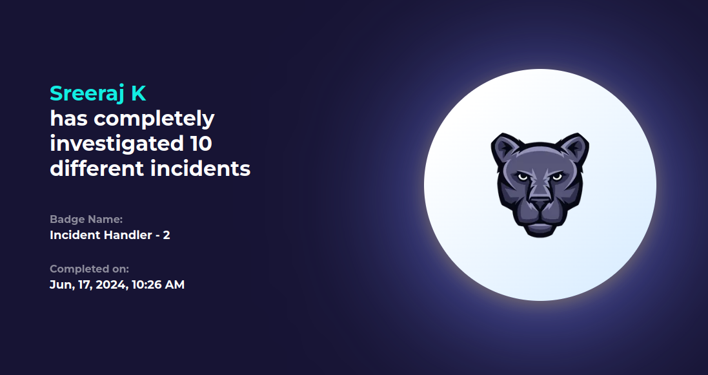

                                                                                                                                                                      
  # Hello, I'm Sreeraj K

  

  
  

                                                                                                                                            
                                                                                                                                                                                    

## About M

I am a dedicated cyber security enthusiast with a strong passion for safeguarding digital environments. Eager to transition into a SOC analyst role, I am committed to continuous learning and contributing to the security and protection of critical systems.

## Skills

| Skill                                                             | Associated Project                                                                                                             |
| ----------------------------------------------------------------- | ------------------------------------------------------------------------------------------------------------------------------ |
| **Threat Detection ,EDR ,C&C ,Incident Response & Containment**   | **[Elastic-SIEM-Home-Lab-And-Elastic-Defend-EDR](https://github.com/SreeRaj-K0/Elastic-SIEM-Home-Lab-And-Elastic-Defend-EDR)** |
| **Host Intrusion Detection, C&C, Detection & Response**           | **[LimaCharlie-EDR-Home-Lab](https://github.com/SreeRaj-K0/LimaCharlie-EDR-Home-Lab)**                                         |
| **Case Management,SIEM Integration, Threat Detection & Response** | **[Wazuh-DFIR-IRIS-Soc-Home-Lab](https://github.com/SreeRaj-K0/Wazuh-DFIR-IRIS-Soc-Home-Lab-)**                                |
| **Intrusion Detection, Log Analysis**                             | **[Intrusion-Detection-Lab](https://github.com/SreeRaj-K0/Intrusion-Detection-Lab)**                                           |
| **Endpoint Monitoring, Threat Hunting**                           | **[Velociraptor-Home-lab](https://github.com/SreeRaj-K0/Velociraptor-Home-lab)**                                            |

## Tools

### Network

    
    
    
    
    

### Endpoint

### SIEM

  

## Certifications

---

